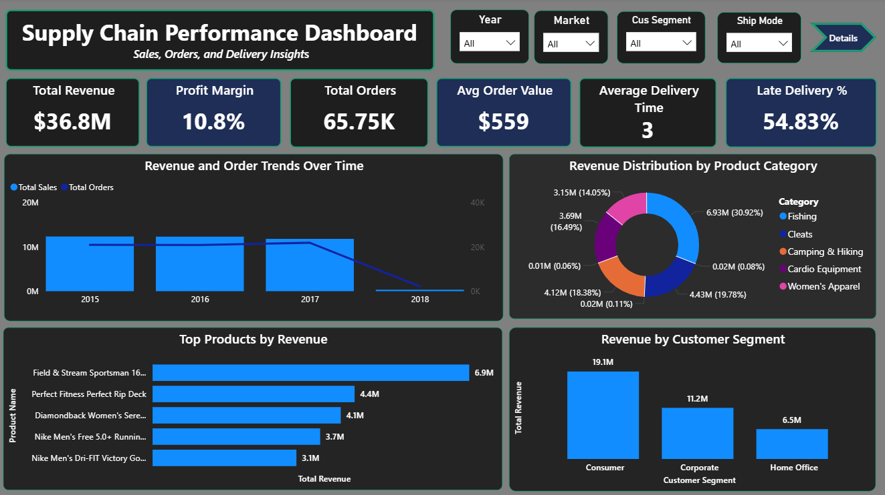
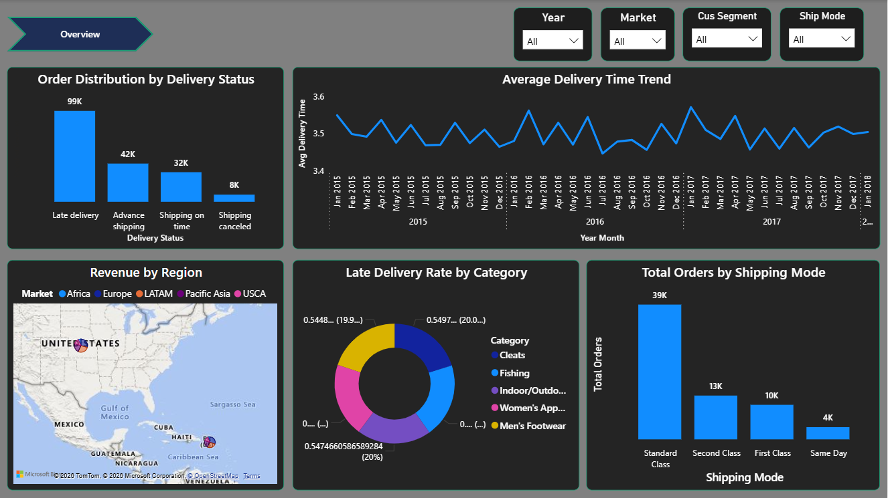

# Supply Chain Analytics Dashboard | Power BI

End-to-end supply chain intelligence system built in Power BI to analyze sales performance, delivery efficiency, logistics delays, and geographic demand distribution.

---

## 🎯 Business Impact Summary

This dashboard enables organizations to:
- Identify **delivery bottlenecks and late shipment drivers**
- Optimize **shipping modes based on cost and performance**
- Track **sales performance across regions and customer segments**
- Improve **operational efficiency using real-time KPI insights**
- Support **data-driven supply chain decision-making**

---

## Dashboard Preview

### Overview Dashboard


### Operational Deep Dive


---

## 📄 Full Business Report

📥 [Download Full Analytics Report (PDF)](supply_chain_report.pdf)

> Includes methodology, KPIs, insights, and business interpretation.

---

## 📌 Key Performance Indicators (KPIs)

| KPI | Business Meaning |
|-----|------------------|
| Total Sales | Revenue generated across all markets |
| Total Orders | Overall demand volume |
| Profit Margin % | Operational efficiency indicator |
| Avg Order Value | Customer purchase strength |
| Late Delivery % | Supply chain reliability metric |
| Avg Delivery Time | Logistics efficiency indicator |

---

## 📊 Dashboard Architecture

### Page 1: Executive Overview
Focused on **business health monitoring**

- KPI Cards (6 core metrics)
- Sales by Product Category (Donut Chart)
- Top Products by Sales (Bar Chart)
- Sales & Orders Trend Analysis (Combo Chart)
- Customer Segment Performance (Column Chart)
- Global slicers (Year, Market, Segment, Shipping Mode)

---

### Page 2: Operational Analytics
Focused on **logistics & delivery performance**

- Delivery Time Trend Analysis (Line Chart)
- Late Delivery Rate by Category (Donut Chart)
- Order Status Distribution (Column Chart)
- Geographic Sales Distribution (Map Visual)
- Shipping Mode Efficiency Analysis
- Consistent slicer-based filtering

---

## 🧠 Key Insights 

- 📉 **54.83% of deliveries are delayed**, with **[Category]** showing highest inefficiency  
- 🚚 **Standard Class** handles the highest order volume but has lower efficiency  
- 📈 Sales and order volumes exhibited a consistent upward trend, with Total Orders and Total Sales showing a strong positive correlation throughout the observed period.  
- 👥 **Consumer Segment** contributes the highest revenue share  
- 🌍 Sales are distributed across multiple global markets including **Europe, LATAM, Pacific Asia, USCA, and 
      Africa.** 

---

## 🛠️ Technical Stack

| Component | Usage |
|----------|------|
| Power BI Desktop | Dashboard development & visualization |
| Power Query | Data cleaning and transformation |
| DAX (Data Analysis Expressions) | KPI calculations & measures |
| Data Modeling | Star schema with Date + Supply Chain dataset |
| Map Visual | Geographic sales distribution |

---

## Data Model Overview

- Fact Table: Orders & Sales Transactions  
- Dimension Tables: Date, Product, Customer, Shipping Mode, Region  
- Relationships: Star Schema Design  
- Calculated Measures: Delivery time, profit margin, delay rate  

---

## 📂 Repository Structure

```
supply-chain-dashboard-powerbi/
│
├── Supply_Chain_dashboard.pbix   # Power BI report file
├── supply_chain_overview.png     # Executive dashboard view
├── supply_chain_details.png      # Operational dashboard view
├── supply_chain_report.pdf       # Business report (PDF)
└── README.md                     # Documentation
```

---

## ⚙️ How to Run This Project

1. Clone or download the repository  
2. Open **Power BI Desktop**  
3. Navigate to:
   ```
   File → Open Report → Browse
   ```
4. Select:
   `Supply_Chain_dashboard.pbix`
5. Use slicers to explore:
   - Year  
   - Market  
   - Customer Segment  
   - Shipping Mode  

---

## 📈 Skills Demonstrated

This project demonstrates industry-relevant competencies:

- Business Intelligence (BI) development  
- Supply Chain Analytics  
- Data storytelling for executive reporting  
- KPI design & performance tracking  
- Data modeling (star schema design)  
- Power BI (DAX + Power Query)  

---

## 💼 Business Value 

This project reflects the ability to:
- Translate raw operational data into business insights  
- Design dashboards for executive decision-making  
- Identify inefficiencies in logistics systems  
- Improve supply chain performance using analytics  
- Communicate insights through visualization  

---

## 🚀 Future Enhancements

- Predictive delay forecasting using ML models  
- Supplier performance benchmarking  
- Inventory optimization dashboard  
- Real-time API data integration  
- Drill-through analysis by region/product  

---

## 👤 About This Project

This project was developed as part of a **data analytics portfolio** demonstrating strong skills in **Power BI, business intelligence, and supply chain analytics**.

📬 Connect on LinkedIn | https://www.linkedin.com/in/minnanourin/

---

⭐ If you find this project useful, consider starring the repository.
